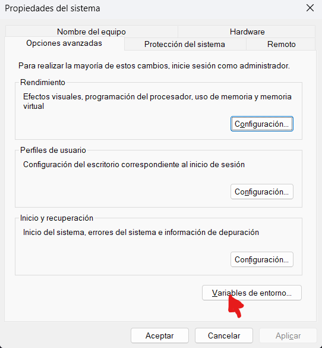
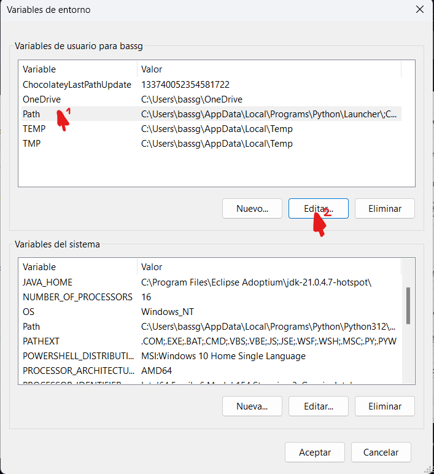

# pSQLexec - PostgreSQL SQL Script Executor

**pSQLexec** es una herramienta desarrollada en **C** para ejecutar archivos `.sql` en una base de datos PostgreSQL. Se realizó debido a lo lento que puede llegar a ser ejecutar los scripts uno por uno.

## Características

- Procesa todos los archivos `.sql` del directorio actual.
- Soporta archivos con espacios en el nombre.
- Internamente usa `psql` para ejecutar los scripts SQL.
- Salida con colores™:
  - **Verde** si la operación funcionó.
  - **Rojo** si hubo un problema.

## Requerimientos

- **PostgreSQL**: PostgreSQL y `psql` deben estar configurados (las rutas `/lib` y `/bin` de tu instalación de Postgres deben estar presentes en tu `PATH` para que funcione correctamente).
- **Compilador C**: Este programa está desarrollado en C, y necesitas un compilador para obtener un binario (por ejemplo: GCC o MSVC).
- **Windows**: El programa está desarrollado para Windows únicamente, aunque se tiene planeada una versión para sistemas Unix-like.

## Instalación

1. Clona el repositorio o descarga el ZIP del código fuente.

   ```bash
   git clone https://github.com/tronprogram/psqlexec.git
   ```

2. Entra a la carpeta del repositorio y compila el proyecto. (En el ejemplo se usa GCC).

   ```bash
   cd psqlexec
   gcc -o psqlexec.exe psqlexec.c
   ```

3. Esto genera el archivo ejecutable `psqlexec.exe`.

4. Si tienes problemas con que Windows no encuentra la ruta del programa `psql`, asegúrate de incluir tu carpeta `/lib` y `/bin` de tu instalación de Postgres en tu `PATH`.

## Uso

### Sintaxis

```bash
psqlexec <usuario_db> <nombre_db> <contra_db>
```

Donde:

- `usuario_db`: Es el usuario con el que te conectas a tu servidor de PostgreSQL.
- `nombre_db`: Es el nombre de tu base de datos.
- `contra_db`: Es la contraseña con la que accedes a tu base de datos.

### Ejemplo:

```bash
psqlexec juanluis db_escuela pepito123
```

Cuando se ejecuta el comando, sucederán las siguientes cosas:

1. `psqlexec` buscará todos los archivos `.sql` en el directorio actual.
2. `psqlexec` ejecutará los archivos encontrados con las credenciales ingresadas.
   - Si hay credenciales incorrectas, el programa no continuará.

## Salida

- Si el programa encuentra archivos válidos y puede procesarlos, imprimirá en la consola lo siguiente:

  ```bash
  script.sql procesado correctamente. Path: "./script.sql"
  ```

- Si el programa encuentra un problema durante la ejecución mostrará la siguiente advertencia:

  ```bash
  Error al procesar script.sql
  ```

- Al final, el programa mostrará la cantidad de archivos procesados:

  ```bash
  2 archivos procesados.
  ```

## Manejo de Errores

- **Faltan argumentos:** Si no se proporcionan todos los argumentos requeridos, el programa muestra un mensaje de uso correcto:

  ```bash
  Faltan argumentos.
  pSQLexec
  Uso: psqlexec <usuario_db> <nombre_db> <contra_db>
  ```

- **Errores durante la ejecución:** Si `psql` no puede ejecutar un archivo `.sql`, se imprime un mensaje de error con el nombre del archivo y el programa pregunta si debería continuar la ejecución.

## Limitaciones

- Solo procesa archivos `.sql` en el directorio actual.
- Requiere credenciales PostgreSQL válidas y un servidor PostgreSQL en ejecución.
- Actualmente funciona solo en sistemas Windows.

## Notas Adicionales

- **Compatibilidad con espacios en nombres de archivos:** Los nombres de archivos con espacios se manejan correctamente al envolverse en comillas dobles.
- **Colores en la terminal:** La salida codificada por colores utiliza códigos de escape ANSI; asegúrate de que tu terminal sea compatible con colores ANSI para obtener la mejor experiencia visual.

### Colores de la Salida

| Color | Significado                     |
| ----- | ------------------------------- |
| Verde | Operación completada con éxito. |
| Rojo  | Error durante la ejecución.     |

### Ejemplo de Salida

#### Procesamiento Exitoso

```bash
parámetros correctos...
mi_script.sql procesado correctamente.
1 archivo procesado.
```

#### Faltan Argumentos

```bash
Faltan argumentos.
pSQLexec
Uso: psqlexec <usuario_db> <nombre_db> <contra_db>
```

#### Error Durante la Ejecución

```bash
mi_script.sql no se pudo procesar...continuar ejecutando? (S/N):
```

## FAQ (Preguntas Frecuentes)

### ¿Qué hacer si `psqlexec` no encuentra `psql`?

Asegúrate de que las carpetas `/bin` y `/lib` de tu instalación de PostgreSQL estén en la variable de entorno `PATH`. Esto permitirá que la terminal y el programa encuentre el ejecutable `psql`. Esto se hace de la siguiente manera:

1. Abre el menú de inicio y busca **"Configuración avanzada del sistema"**.
   <br>
   
   <br>
2. Haz clic en el botón **"Variables de entorno"**.
   <br>
   
   <br>
3. En la sección **Variables de usuario para [Nombre de usuario]**, busca la variable llamada `Path` y haz clic en **Editar**.
   <br>
   
   <br>
4. En la ventana de edición, haz clic en **Nuevo** e ingresa las rutas completas a las carpetas `/bin` y `/lib` de tu instalación de PostgreSQL, por ejemplo:

   ```
   C:\Program Files\PostgreSQL\17\bin
   C:\Program Files\PostgreSQL\17\lib
   ```

   - Este número puede cambiar dependiendo de tu versión instalada de Postgres.

5. Haz clic en **Aceptar** para cerrar todas las ventanas.

6. Abre una nueva ventana de terminal y escribe `psql --version` para verificar que el cambio fue exitoso. Debería retornar lo siguiente:

   ```bash
   c:\>psql --version
   psql (PostgreSQL) 17.0
   ```

   - Es posible que tengas que cerrar sesión o reiniciar tu computador para que se apliquen los cambios.

### ¿Por qué el programa no procesa archivos fuera del directorio actual?

Actualmente, `psqlexec` solo está diseñado para trabajar en el directorio donde se ejecuta. Puedes mover tus archivos `.sql` al directorio actual para que sean procesados.

### ¿Qué pasa si hay un error en uno de los archivos `.sql`?

El programa mostrará un mensaje de error y te preguntará si deseas continuar con la ejecución. También mostrará la salida de error de `psql`.

### ¿Cómo funciona el manejo de nombres de archivo con espacios?

Los nombres de archivo con espacios se manejan envolviéndolos en comillas dobles (`"`), garantizando que el sistema los interprete correctamente.

### ¿Este programa funciona en Linux o macOS?

Actualmente no, pero una versión para sistemas Unix-like está en planes de desarrollo.

### ¿Puedo personalizar los colores de la salida?

No en esta versión. Sin embargo, puedes modificar los códigos de escape ANSI en el código fuente para cambiar los colores.

## Licencia

Este proyecto está licenciado bajo la Licencia MIT. Más información en el archivo [LICENSE](./LICENSE).
